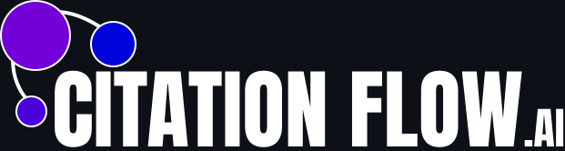

<div align="center">
  

  <h3><strong>CitationFlow.AI</strong></h3>
  <p><em>Graph-Based Visualization of the AI Research Landscape</em></p>

  [](LICENSE)
  [](https://www.python.org/)
  [](https://d3js.org/)
</div>

---

## 📌 Table of Contents  
- [🚀 Overview](#-overview)  
- [🛠️ Tech Stack](#%EF%B8%8F-tech-stack)  
- [⚡ Getting Started](#-getting-started)  
- [🗺️ Roadmap](#%EF%B8%8F-roadmap)  
- [🔮 Upcoming Features](#-upcoming-features)  
- [🙏 Acknowledgements](#-acknowledgements)  
- [👥 Contributors](#-contributors)  
- [📜 License](#-license)  

---

## 🚀 Overview  
**CitationFlow.AI** is an interactive tool that maps the evolving landscape of artificial intelligence research as a dynamic citation graph. It enables users to visually explore relationships between papers, discover emerging topics, and identify influential authors—without reading hundreds of articles.

Try by your self [here](http://147.45.157.105)

### 🔑 Key Features  
| Feature              | Description                                                                 |
|----------------------|-----------------------------------------------------------------------------|
| **Graph Visualization** | Force-directed graph of articles (nodes) and citations (edges).              |
| **Insightful Statistics** | Explore top authors, trending topics, and dataset summaries.               |
| **Advanced Filtering** | Drill down into specific research areas, timeframes, or authors.           |

**Target Users**: AI researchers, students, and professionals exploring scholarly literature.  
**Data Source**: [ScienceDirect API](https://www.elsevier.com/solutions/sciencedirect)

---

## 🛠️ Tech Stack  

### 🗃️ Backend & Database  
| Technology     | Purpose                                      |
|----------------|----------------------------------------------|
| **Python 3.9+** | Data pipeline, API integration, backend logic |
| **FastAPI**     | Fast and modern web API framework            |
| **Pandas**      | Data wrangling and transformation            |
| **PostgreSQL**  | Structured storage for citation networks     |

### 🎨 Frontend & Visualization  
| Technology   | Purpose                                      |
|--------------|----------------------------------------------|
| **D3.js 7.8+** | Graph rendering and force simulations        |
| **JavaScript (ES6+)** | Interactive UI and event handling         |

---

## ⚡ Getting Started  

### 🐳 Quick Setup (via Docker)  

1. **Create a `.env` file** with your database credentials:
    ```bash
    DB_USER=postgres
    DB_PASSWORD=password
    DB_NAME=cf_test
    DB_HOST=db
    DB_PORT=5432
    ```

2. **Clone the repository**:
    ```bash
    git clone https://github.com/Data-Wrangling-and-Visualisation/CitationFlow.AI
    cd CitationFlow.AI
    ```

3. **Build and launch the app**:
    ```bash
    docker-compose up --build
    ```

4. Access the app in your browser:  
   🔗 [http://localhost](http://localhost)

---

## 🗺️ Roadmap  

| Phase                     | Status | Key Tasks                                      |
|---------------------------|--------|------------------------------------------------|
| **Project Setup & API Integration** | ✅     | Base structure, ScienceDirect API integration  |
| **Data Pipeline**         | ✅     | Extraction, cleaning, DB schema design         |
| **Visualization**         | ✅     | Interactive D3.js graph                        |
| **UI/UX Enhancements**    | ✅     | Filters, search, responsive interface          |
| **Performance Optimization** | ✅ | Graph rendering optimizations and testing      |

---

## 🔮 Upcoming Features  
- 🕒 **Temporal Visualization** – View research trends evolving over time  
- 🎛️ **Custom Views** – Save/export subgraphs and favorite topics  
- 🤝 **Collaboration Tools** – Shared bookmarks, notes, and annotations  

---

## 🙏 Acknowledgements  
- 📚 Data powered by [ScienceDirect (Elsevier)](https://www.elsevier.com/solutions/sciencedirect)  
- 🎓 Developed with support from **Innopolis University**  

---

## 👥 Contributors  

| Role            | Name              | Email                                  |
|------------------|-------------------|----------------------------------------|
| **Team Lead**     | Marsel Berheev    | m.berheeev@innopolis.university        |
| **Data Engineer** | Nikita Stepankov  | n.stepankov@innopolis.university       |
| **DB Architect**  | Makar Egorov      | m.egorov@innopolis.university          |

---

## 📜 License  
This project is licensed under the [MIT License](LICENSE).  

---

<div align="center">
  <strong>✨ Explore the future of AI research with CitationFlow.AI ✨</strong>
</div>
